# Groundskeeper architecture

Groundskeeper connects code changes to documentation claims, stores the resulting evidence, and gives a team a place to decide what needs attention. Analysis, verification, and repair publication are distinct operations. A documentation claim affected by a code change is a review candidate; it is not proof that an example failed. A dismissed review is a team decision; it is not proof that an example passed.

This document describes the repository implementation. The public Vercel application currently runs in demo mode. Live PostgreSQL, webhook ingress, a continuously running worker, and GitHub App/OAuth credentials still need provisioning and configuration. The intended Neon and Railway connections are not evidence of deployed infrastructure. The hosting budget remains **free tiers only, $0 paid spend**.

## System diagram

[Mermaid source](diagrams/system-architecture.mmd) · [Open scalable SVG](diagrams/system-architecture.svg)

Blue is the deployed web application; its live data path is implemented but inactive in demo mode. Amber is the database and background processing that needs live infrastructure. Purple is the explicit operator workflow, which requires its own execution environment. Gray is GitHub. The arrows describe implemented data paths, not a claim that every service is currently running.

| Component | Responsibility | Code |
| --- | --- | --- |
| Next.js application | Dashboard, review inbox, operations view, evidence review, role-aware shared review editing, and validated API responses | [`apps/web/components`](../apps/web/components), [`apps/web/app/api`](../apps/web/app/api) |
| Server access boundary | GitHub OAuth, session validation, installation isolation, and viewer/reviewer/admin permissions | [`team-auth.ts`](../apps/web/lib/team-auth.ts), [`team-access.ts`](../packages/database/src/team-access.ts) |
| PostgreSQL and Prisma | Durable deliveries, immutable reports, compact report summaries, sessions, membership, shared state and audit history | [`schema.prisma`](../packages/database/prisma/schema.prisma), [`packages/database/src`](../packages/database/src) |
| Webhook ingress | Verify signed GitHub deliveries through Probot and durably record routing metadata before returning success | [`main.ts`](../apps/github/src/main.ts), [`app.ts`](../apps/github/src/app.ts) |
| Supervised worker | Run one finite batch at a time, bound execution, back off on failures, expose health, and drain on shutdown | [`worker-serve.ts`](../apps/github/src/worker-serve.ts), [`worker-child.ts`](../apps/github/src/worker-child.ts), [`worker-loop.ts`](../apps/github/src/worker-loop.ts) |
| Analysis pipeline | Fetch exact GitHub snapshots, parse documentation claims in TypeScript, then analyze code changes and claim impact in Python | [`snapshots.ts`](../apps/github/src/snapshots.ts), [`packages/parser`](../packages/parser), [`analysis.ts`](../apps/github/src/analysis.ts), [`services/analysis`](../services/analysis) |
| Verification and repair | Explicitly execute selected examples in restricted Docker containers; preserve artifacts; reverify before an approved draft PR | [`verify-run.ts`](../apps/github/src/verify-run.ts), [`repairs`](../apps/github/src/repairs), [`repair-main.ts`](../apps/github/src/repair-main.ts) |

## Background processing and recovery

1. Probot receives signed installation, repository-selection, push, and pull-request events. Push ingestion excludes deleted branches and nondefault branches. Only small routing fields, IDs, and pinned commits enter `WebhookDelivery`; source bodies and credentials do not.
2. The worker claims push and pull-request deliveries with PostgreSQL row locks and `SKIP LOCKED`. A claim consumes one attempt and receives a ten-minute lease with a unique token. Lifecycle events can be stored, but this worker does not process installation or repository-selection lifecycle changes.
3. The GitHub App authenticates for the installation and fetches pinned snapshots. Push analysis compares before and after commits. Eligible same-repository pull requests compare their merge base against the pinned head; closed, fork, and superseded cases are handled explicitly. Snapshot checks enforce repository identity, blob identity, size, and deadline limits.
4. The TypeScript parser extracts documentation claims. The trusted Python analysis module receives JSON data and produces symbols, changes, links, impact candidates, and report health. Ingestion does not execute repository examples.
5. `storeAnalysisRun` writes an immutable report under the installation-scoped repository before the worker acknowledges the delivery. The delivery ID is the idempotency key. Replays reuse an identical stored result; conflicting identity or content is rejected.
6. Lease tokens fence report persistence, acknowledgment, and failure updates. An expired worker cannot finish with a stale token. Failed jobs wait five minutes between attempts, with five claimed attempts before a terminal failure. Crashes recover after lease expiry; operations tools expose retained failed jobs for explicit retry.

The supervisor starts sequential one-job child batches. It caps each child at four minutes, backs off with jitter up to sixty seconds, and allows thirty seconds to drain on shutdown. These process controls complement the database lease; they do not replace it. See [worker operations](WORKER_OPERATIONS.md) and [pull-request processing](PULL_REQUEST_WORKER.md).

## Identity and authorization

[Mermaid source](diagrams/access-boundary.mmd) · [Open scalable SVG](diagrams/access-boundary.svg)

GitHub OAuth uses signed, expiring state and PKCE. An approved numeric GitHub identity receives an eight-hour `Secure`, `HttpOnly`, `SameSite=Lax` host cookie. The database stores the session token's SHA-256 hash, not its raw value. OAuth access tokens are used during identity lookup and are not stored as application sessions.

Every team request rechecks the current installation membership and role. Viewers can read; reviewers and admins can save shared reviews. Role is read from membership rather than cached in the cookie, so a downgrade applies to the next request. Shared review writes also recheck membership and role under transaction locks. Removing a member cascades deletion of their sessions while preserving actor-attributed review history.

Membership and role changes are operator CLI capabilities. The admin role does not imply a browser-based membership console or permission to publish a repair. Existing members migrate to reviewer to preserve their existing review capability. GitHub organization membership alone does not authorize access; the explicit installation allowlist is authoritative.

A legacy bearer token supports the dashboard's analysis and operations reads only when OAuth is entirely unconfigured. Any partial OAuth configuration fails closed instead of reverting to the token. Shared review state and the inbox require team sessions. See [team access](TEAM_ACCESS.md) and [query/response architecture](QUERY_RESPONSE_ARCHITECTURE.md).

## Stored data and boundaries

- `Workspace` owns installation-scoped repositories and team members. Repository IDs and numeric installation IDs are checked before analysis or verification persistence.
- `AnalysisRun` and `VerificationRun` hold immutable reports and their commit/input identities. PostgreSQL generates compact, versioned `summary` JSON columns from those reports for list queries. Migration backfills them, and the database recomputes them on writes; no background synchronization job is required. Adding stored generated columns rewrites/backfills existing tables under an exclusive lock, and the new indexes are nonconcurrent. This fits the current pre-live setup; an existing large installation needs a maintenance window and enough free disk for the rewrite. It is not a zero-downtime migration.
- The dashboard and inbox read summaries, not full report documents. Analysis summaries carry claim counts. Verification summaries carry at most the first 100 outcomes plus flags calculated over the full evidence set. Missing or invalid summaries never create a verified verdict and never trigger a full-report fallback. Valid impact or failure evidence can still produce a needs-review result; otherwise the status remains unknown.
- Detailed run review explicitly reads a single owned report and returns bounded claim excerpts and reasons. Sandbox stdout/stderr are excluded from web projections.
- `SharedReview` is mutable, versioned state. Each successful change appends `SharedReviewEvent` atomically with the actor's numeric GitHub identity and login. Review decisions do not rewrite analysis or verification evidence.
- Delivery IDs and publication reservations remain durable recovery records. Storage maintenance is an operator-invoked, installation-scoped, bounded cleanup of expired sessions; it does not delete reports, audit events, webhooks, or replay identities. See [storage maintenance](STORAGE_MAINTENANCE.md).
- Browser-local saved inbox views store at most eight named, applied filter preferences. Demo storage is separate; live storage is scoped by a server-derived installation/user hash. Unavailable or corrupted storage is reported, with in-memory fallback on write failure. Local annotations and saved views are not shared database state. Tokens, session values, and source reports do not belong in a saved filter view.

The run index covers repository, creation time, and ID; the verification index covers run, creation time, and ID. A tenant queue index serves installation-scoped operations reads while the global worker claim indexes remain available. Session expiry lookup is indexed by workspace, expiry, and token hash. New database timestamp defaults are explicitly UTC; the migration does not reinterpret historical timestamps. These indexes support the query paths; they do not constitute an isolation boundary by themselves.

## Verification and repair are explicit

`verify:run` loads an owned analysis, refetches its pinned Python sources, and runs selected examples through the verification process and Docker. It saves an immutable local evidence artifact before attempting database persistence. `verify:import` can validate and import that artifact after a persistence failure without reexecuting the examples. A missing Docker runtime, skipped block, or incomplete evidence remains visible; it cannot become a passing result by fallback.

Repair preparation reproduces the baseline, validates the proposed change, and writes an immutable verified or blocked proposal. Publication requires an explicit approved proposal ID, fresh independent verification, exact base/head checks, an atomic database budget reservation, and a fenced publication lease. The publisher creates a review branch and a draft PR and reconciles partial failures when the same proposal is retried. It does not merge changes. The web interface has no background execution or GitHub publication endpoint.

Local artifacts are filesystem state, not hosted object storage. The Vercel deployment does not automatically receive an operator's `.groundskeeper` directory. The live artifact review route therefore requires the corresponding artifact to exist in its runtime; demo diffs do not establish hosted artifact availability. See [repair workflow](REPAIR_WORKFLOW.md) and [evidence recovery](EVIDENCE_RECOVERY.md).

## Operational truth

The public web health endpoint reports demo mode with `liveReady: false`. In live mode it checks authentication configuration, database connectivity, and required schema access, including both analysis and verification summary columns. A missing summary migration returns `503` with `liveReady: false`. It does not attest that OAuth provider calls work, that a GitHub webhook is being delivered, or that the worker is running.

Worker liveness and readiness are separate private-network HTTP endpoints. The web operations view derives queue counts, oldest unfinished time, recent analysis completion, and up to ten failed or stalled deliveries from PostgreSQL. It deliberately reports worker status as unknown because queue activity is not a worker heartbeat.

A complete live deployment still needs a database connection and migrations, GitHub App and OAuth configuration, a public signed-webhook ingress, an independently hosted worker, and an execution environment for explicit verification. Database backups/restore drills, external alerting, and a hosted worker soak test remain operational work. Running CI or rendering these diagrams does not establish those live guarantees.
