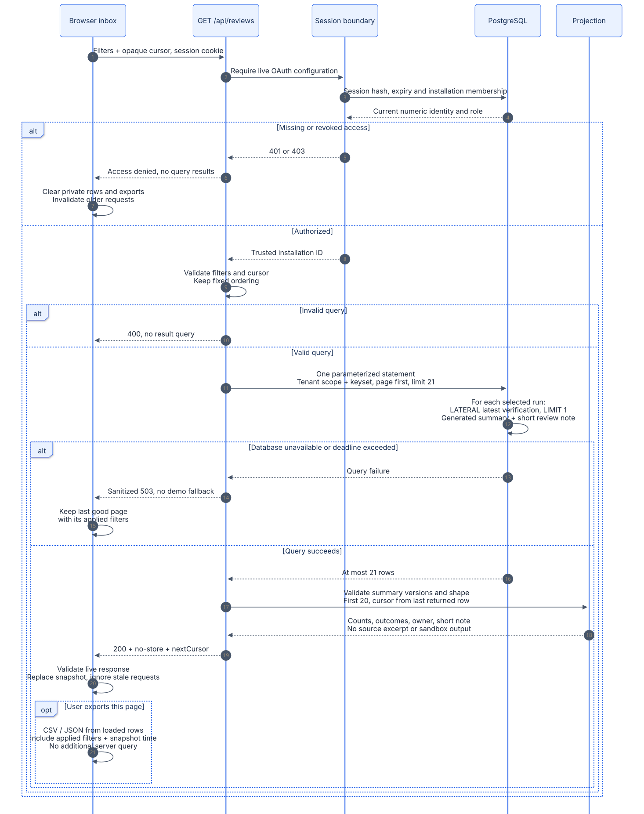
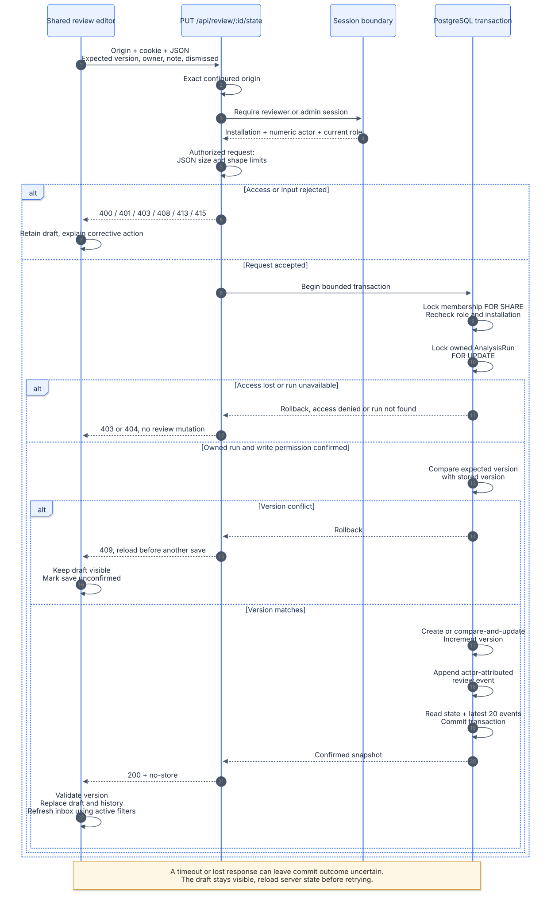

# Query and response architecture

The web server is the authorization and projection boundary. The browser never receives database credentials, GitHub App secrets, lease tokens, or raw sandbox streams. Each live query derives its installation scope from server configuration and an authenticated session or permitted legacy token; it never trusts a client-supplied workspace identity.

The current public deployment is a demo. The sequences below describe implemented live paths that become active once live infrastructure and credentials are configured. Demo data is explicit and never substitutes for a failed live request.

## Read path: filtered review inbox

[Mermaid source](diagrams/query-read-sequence.mmd) · [Open scalable SVG](diagrams/query-read-sequence.svg)

The inbox accepts a strict allowlist of query parameters. Status is `open`, `dismissed`, or `all`; owner and repository use exact, case-insensitive matching; unassigned means either no shared review or an empty owner. A missing review is open. Repeated/unknown fields, contradictory owner/unassigned filters, invalid names, and malformed cursors are rejected.

Results use descending creation time and ID. The server reads 21 rows, returns at most 20, and derives the next cursor from the final returned row. The following page applies `createdAt < cursorTime OR (createdAt = cursorTime AND id < cursorId)` inside the same installation boundary. A cursor is an opaque position, not an access grant. New rows inserted above the first page do not shift offsets; changing review state during pagination can change membership of later filtered pages, so this is not a frozen cross-request snapshot.

PostgreSQL `STORED` generated summaries remove large report JSON from dashboard and inbox list queries. `gk_analysis_summary_v1(report)` derives health counts; `gk_verification_summary_v1(report)` derives a bounded outcome list and full-set `allPassed`/`hasFailed` flags. Readers validate summary versions and shape. Missing or invalid summaries cannot create a verified verdict or trigger a full-report fallback. Valid impact or failure evidence can still produce needs-review; without that evidence the result stays unknown. Detailed review is the separate, explicit path for bounded claim excerpts.

After a successful response, the browser validates its shape and live mode before replacing the displayed snapshot. Changing filters starts a new traversal. Aborted or superseded requests cannot overwrite newer results. A temporary failure keeps the last successful page labeled with its actual applied filters; rejected team access clears private rows. The dashboard also clears loaded reports, evidence dialogs, quick-action results and export data after a confirmed `401`/`403`. A request generation check prevents an older refresh from restoring data after that rejection. Saved views persist at most eight names and applied filter sets locally and reissue the same authorized query when selected. Demo and live namespaces are separate. The live namespace uses a server-derived SHA-256 installation/user scope; it is an identifier, not a credential or access grant. Storage failures are visible and fall back to the current in-memory view list.

## Write path: shared review with optimistic concurrency

[Mermaid source](diagrams/query-write-sequence.mmd) · [Open scalable SVG](diagrams/query-write-sequence.svg)

The request contains exactly `version`, `owner`, `note`, and `dismissed`. The API checks the configured HTTPS origin, team session, current write role, JSON content type, and bounded body before calling the database module. Reviewers and admins may write; viewers may read. The database repeats the role check under a membership lock, so a role change between the HTTP check and the transaction cannot bypass enforcement.

The transaction locks the member against concurrent revoke and locks the owned analysis to serialize initial writes. It compares the expected version with the stored version (zero when absent). A mismatch returns `409`. An existing row is updated with a version predicate; the first state is created under the same run lock. Both paths append the actor-attributed event in the same transaction before returning the saved state and latest 20 events.

A successful save replaces the editor's confirmed state and refreshes the inbox under the current filters. A failed or ambiguous save retains the draft and requires a reload before retrying. The server may commit before a response is lost, so a network error is never described as proof that nothing was saved. No browser retry silently overwrites a teammate's later version.

## Team administration: versioned membership and audit

Only current admins can read or mutate the installation's team directory. The roster is paged by ascending numeric GitHub ID, at most 50 members plus one lookahead. The response also includes `Workspace.teamVersion` and the latest 20 membership events. Each member projects at most one last-known session login, using the dedicated `(workspaceId, githubUserId, createdAt, tokenHash)` index. This also supports session removal by member; the separate expiry index serves cleanup rather than this lookup. Pagination does not freeze membership across requests, and the bounded event list is not a complete audit export.

The browser submits exactly `version`, `githubUserId` as a decimal string, and `role` (`viewer`, `reviewer`, `admin`, or `null`). The API validates OAuth, current admin role, exact configured Origin, JSON shape, a 4 KiB stream cap, and a five-second body deadline. It derives actor identity and installation from the session. Reviewers and viewers cannot obtain the roster or make changes; their Team access screen is informational.

The mutation locks the workspace before member rows, rechecks current admin membership, and performs compare-and-swap against `Workspace.teamVersion`. A stale version returns `409`. A real change updates membership, increments the version, and appends `TeamAccessEvent` in the same transaction. A current-version no-op records no fabricated change. The lock prevents two concurrent admin removals from violating the final-admin rule; both browser and operator CLI changes enforce that rule. Operator bootstrap uses the same locked, audited engine, with actor source `operator` rather than a fabricated GitHub identity. The database-credential CLI does not submit a browser version; it changes the current locked state and still enforces final-admin protection.

Revocation cascades deletion of the member's hashed sessions. Audit actors are retained independently of current membership, so revocation and regrant do not erase history or revive sessions. The history starts with this release's recorded changes; it does not invent events for preexisting grants. There are no invitation emails or organization-membership grants.

After a change, the browser reloads the team before enabling another edit. An uncertain response or failed reload keeps editing paused until a successful read; transport failure does not establish whether the transaction committed. Permission denial clears the private roster. Demo mode simulates changes only for the current visit.

## Route contracts

“Dashboard access” means a current OAuth team session when OAuth is configured, or a constant-time checked bearer token only when OAuth is entirely unconfigured. “Team access” always requires the OAuth session and current installation membership. All successful data responses use `Cache-Control: no-store`; private routes vary on cookie/authorization as applicable.

| Route | Live access and scope | Query and response boundary |
| --- | --- | --- |
| `GET /api/dashboard` | Dashboard access; installation-scoped repositories, runs, and deliveries | At most 50 repositories, 50 newest runs, and 50 unfinished push/PR deliveries. Compact analysis/latest-verification summaries; at most 100 displayed outcomes per run. |
| `GET /api/reviews` | Team access; installation scope reapplied on every page | Open/dismissed/all, exact owner, unassigned, exact repository; fixed 20-row keyset pages plus one lookahead. Counts, outcome summaries, owner, 160-character note snippet, version, and update time. No claim excerpts. |
| `GET /api/review/:id` | Dashboard access; run ID and installation checked together | One report; at most 20 findings, each with a claim excerpt capped at 4,000 characters and up to 20 linked changed symbols. Latest execution status/reason, no stdout/stderr. A missing or foreign run is `404`. |
| `GET /api/operations` | Dashboard access; installation-scoped unfinished push/PR deliveries and runs | Three data queries: conditional queue aggregates, analysis aggregate, and at most 10 failed/stalled jobs. Oldest unfinished time, last analysis time and last-24-hour completion count share a repeatable-read snapshot and UTC cutoff. No payload, error text, or lease token; worker status remains unknown. |
| `GET /api/review/:id/state` | Team access; member and owned-run checks in a transaction | Current shared state and at most 20 latest audit events. Owner max 100 characters, note max 2,000. Does not grant access through the legacy bearer token. |
| `PUT /api/review/:id/state` | Reviewer/admin team access; exact origin; membership/role rechecked under lock | Strict JSON, body max 16 KiB, expected version, atomic state/event write. `409` on conflict, `403` after role/revoke failure, `404` for an unowned run. |
| `GET /api/repairs/:digest` | Dashboard access; artifact installation identity and content digest checked | A fixed local artifact path, 64-character SHA-256 digest, regular file/no-follow checks, and 32 MB maximum read. Bounded before/after documents plus evidence counts; no execution output. The public deployment has no automatic artifact upload. |
| `GET /api/team` | Admin OAuth access; installation and role rechecked under workspace lock | At most 50 members plus one lookahead, numeric-ID cursor, current team version, latest 20 events; no session values or hashes. |
| `PUT /api/team` | Admin OAuth access; exact origin; admin rechecked under workspace lock | Strict JSON, 4 KiB streamed body, expected team version, atomic membership/version/audit change. `409` on stale version or last-admin removal; no legacy bearer access. |
| `GET /api/auth/session` | Team access | Numeric GitHub identity as text, login, current role, and a derived storage scope. No cookie value, token hash, or infrastructure details. |
| `GET /api/health` | Public, redacted | Demo mode returns `liveReady: false`. Live checks configuration and schema access, including both generated summary columns; missing migrations return `503`. Does not verify webhook delivery, worker uptime, or sandbox availability. |

OAuth has separate login/callback routes using state and PKCE. Logout is a same-origin POST that revokes the current session and expires its cookie. These are identity operations rather than report queries. See [`team-auth.ts`](../apps/web/lib/team-auth.ts).

## Bounds, caching, and failure handling

| Boundary | Implementation limit or behavior |
| --- | --- |
| General live database readers | One connection per request client; five-second connection/pool limits; transaction max wait five seconds and timeout ten seconds; disconnect in `finally`. |
| Team session lookup | Five-second connection/pool and transaction bounds; reads current member role each time. |
| Shared review transaction | Three-second transaction acquisition and five-second transaction timeout; three-second lock timeout and four-second statement timeout. State and audit update commit together. |
| Team membership transaction | Workspace lock before member locks; three-second acquisition, five-second transaction, three-second lock and four-second statement timeouts. Membership, team version and audit commit together. |
| Operations snapshot | Three data queries in a repeatable-read transaction with a four-second statement timeout. Aggregate bigint counts must fit safe JavaScript integers; corrupt negative attempts or contradictory totals fail closed. |
| Web readiness probe | Three-second connection/pool and transaction bounds; sanitized `503` on failure. |
| Request body | Shared review body max 16 KiB; team change max 4 KiB. Both have five-second stream deadlines and reject malformed or extra fields. |
| Browser waits | Dashboard and session reads use ten-second request deadlines; inbox, shared review and team administration requests use fifteen-second deadlines. New requests/unmount abort prior work. |
| Authentication failure | `401` for an absent/expired/unapproved session; `403` for a denied role, invalid write origin, or membership loss detected in the write transaction. Secrets and raw provider/database errors are withheld. |
| Temporary read failure | Sanitized `503`; no implicit demo switch. Inbox preserves the last good snapshot and its applied-filter label unless access has been rejected. |
| Write conflict or uncertain response | Preserve the draft; require a confirmed reload before another save. The latest server version is the concurrency authority. |
| Missing data | Installation-scoped `404` avoids revealing that a run or artifact belongs to another workspace. |
| Cache policy | `no-store` on data and auth responses; browser requests also opt out of caching. No shared response cache is used for private projections. |

A browser request deadline is not a distributed transaction deadline. Session lookup and the subsequent data query have their own server bounds; the database may still finish after the browser stops waiting. This is especially relevant for writes and is why the editor treats transport failure as uncertain.

## Implementation map

| Concern | Source |
| --- | --- |
| Versioned summary validation | [`report-summaries.ts`](../packages/database/src/report-summaries.ts) |
| Shared dashboard authorization and summary projection | [`dashboard-data.ts`](../apps/web/lib/dashboard-data.ts) |
| Inbox filters, keyset query, bounds, and API response | [`review-inbox-data.ts`](../apps/web/lib/review-inbox-data.ts) |
| Browser inbox validation and failure classification | [`review-inbox-client.ts`](../apps/web/lib/review-inbox-client.ts), [`review-inbox-types.ts`](../apps/web/lib/review-inbox-types.ts) |
| Applied-filter snapshots, pagination, saved views, and refresh | [`review-inbox.tsx`](../apps/web/components/review-inbox.tsx) |
| Detailed evidence projection | [`review-data.ts`](../apps/web/lib/review-data.ts) |
| Operations snapshot | [`operations-data.ts`](../apps/web/lib/operations-data.ts) |
| HTTP write boundary | [`shared-review-api.ts`](../apps/web/lib/shared-review-api.ts) |
| Team directory, admin authorization, versioned membership and audit | [`team-access.ts`](../packages/database/src/team-access.ts), [`team-management-api.ts`](../apps/web/lib/team-management-api.ts), [`team-access.tsx`](../apps/web/components/team-access.tsx) |
| Membership locks, compare-and-update, audit transaction | [`shared-reviews.ts`](../packages/database/src/shared-reviews.ts) |
| Schema, generated summary functions, and indexes | [`schema.prisma`](../packages/database/prisma/schema.prisma), [`migrations`](../packages/database/prisma/migrations) |

Raw Mermaid sources and rendered SVGs are checked in together under [`docs/diagrams`](diagrams). SVG exports preserve readable text and can be opened independently of a Markdown renderer.

Diagrams were rendered with Mermaid CLI `12.0.0` and an existing Playwright Chromium executable, using the checked-in [renderer configuration](diagrams/mermaid.config.json). The CLI was run from the temporary pnpm cache; no application dependencies were added. Every source includes an accessible title and description, which are carried into its SVG export.
